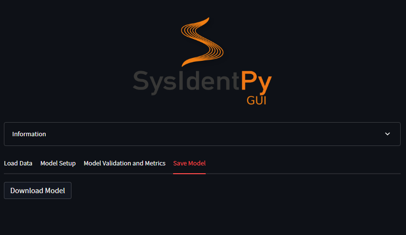
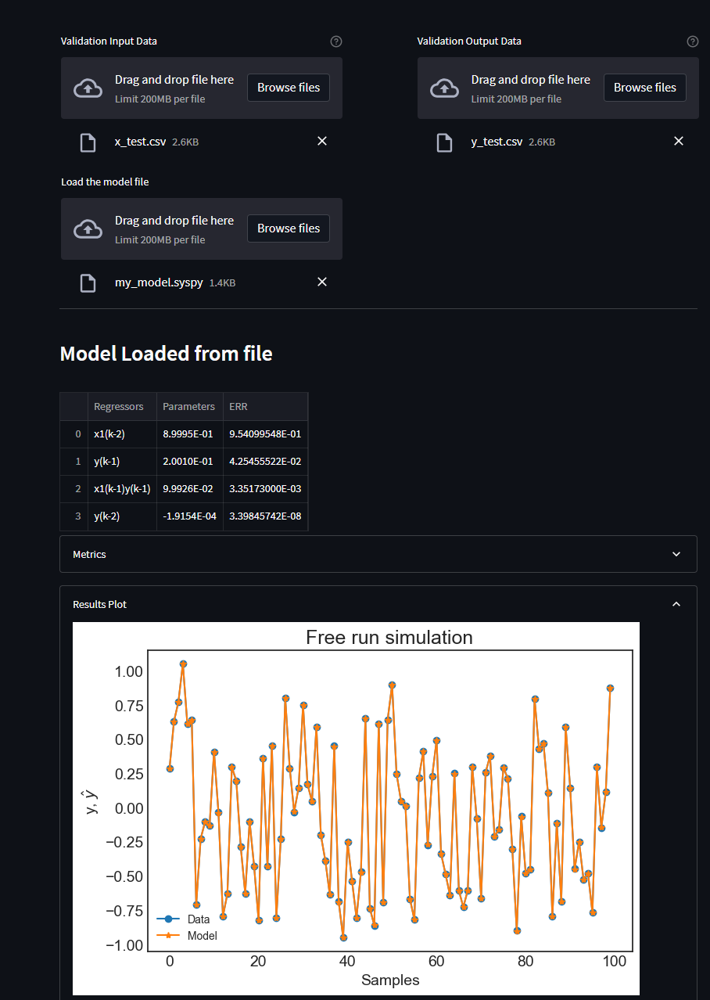

# Summary

The field of System Identification (SI) aims to build mathematical models for static and dynamic behavior from experimental data [@Lju1987]. In particular, nonlinear system identification has become a central issue in the SI community, and from the 1950s onwards many methods have been proposed. In this respect, NARMAX (Nonlinear AutoRegressive Moving Average with eXogenous input) models are among the most well-documented and used model representation of dynamical systems [@Bil2013].

In this context, `SysIdentPy` is a package designed for system identification using polynomial NARMAX models [@Wil2020]. It can handle SISO (Single-Input Single-Output) and MISO (Multiple-Inputs Single-Output) NARMAX model identification and its variants such as NARX, NAR, ARMAX, ARX, and AR models. `SysIdentPy` provides various tools for both model structure selection and parameter estimation including classical algorithms, e.g., forward regression orthogonal least squares and extended least squares orthogonal forward regression; parameter estimation using ordinary least squares, recursive algorithms and adaptative filters; the Akaike Information Criterion (AIC), Bayesian Information Criterion (BIC), Khinchin's law of iterated logarithm criterion (LILC), and Final Prediction Error (FPE) methods for model order selection [@HK1999]; regression metrics; and residual analysis. The reader is referred to the package documentation for further details.

# SysIdentPyGUI

`SysIdentPyGUI` is a web app for the Python module `SysIdentPy` in the format of a Graphical User Interface (GUI). It was written using the `Streamlit` library, which allows the creation of web apps in a compact Python syntax. `SysIdentPyGUI` comes as an use alternative for people that would like to use `SysIdentPy` toolbox but aren't familiar with Python, such as medical or economy students. The application currently has the following `SysIdentPy` features implemented:

- Model identification using AOLS, ER, MetaMSS and FROLS, through a Polynomial or Fourier basis function
- Download your model
- Load and validate your model
- Simulate a predefined model

# Example of usage

## Model Identification

Through `SysIdentPyGUI` you can quickly identify the mathematical model that approximates the behaviour of given data. The demonstration of this funcionality will be made using pseudorandom data generated by **sysidentpy.utils.generate_data** module on `SysIdentPy`. First, in the 'Load Data' tab, the user upload the input and output datasets from the system and adjust the percentage of data that will be used for validation later:

In the 'Model Setup' tab, the user will configurate the model: choosing between Polynomial and Fourier basis function for the representation; selecting one of the four model structure selection algorithm (Forward regression orthogonal least squares, Acelerated orthogonal least squares, Entropic regression and Meta model structure selection); setting the parameters related to each one of the cited algorithms; defining the specific lags for input and output; picking the estimators and model type to be used and lastly setting the predict options (choosing between a free run simulation or k-steps ahead simulation):

The 'Model Validation and Metrics' tab gives to the user the results of the identified system: the regressors and its parameters, the plots for results and residues, as well as the metrics (MSE, RMSE, MAE, RMSE and many others):

In the last tab, 'Save Model', is available for the user to download the fitted model for posterior analysis in the 'Load your Model' page.

## Loading a Model

In this page, the user can load the previously fitted model for new analysis. First, we upload the input and output data that will be used for validation and study. Then, the model file that was saved beforehand should also be loaded.

As soon as the model is loaded, the application will display the regressors and its parameters, metrics and the results/residues plots for the system, for the given data:

## Simulate a Predefined Model

The user can simulate a model known beforehand (regressors and parameters), using the regressors codification that is described in `SysIdentPy` documentation, you can enter a model that will be fitted with the uploaded data.

We start loading the input and output datasets into the app:

Then, we set the nonlinearity degree of the model and enter the list with the the especific regressors (each regressor group at a time):

Then, we set the parameter value for each regressor group:

The last step is configurating the fitting arguments and clicking the 'Simulate the model' button:

The aplication then outputs the model equation formated, the metrics and results/residues plots for analysis:

# References